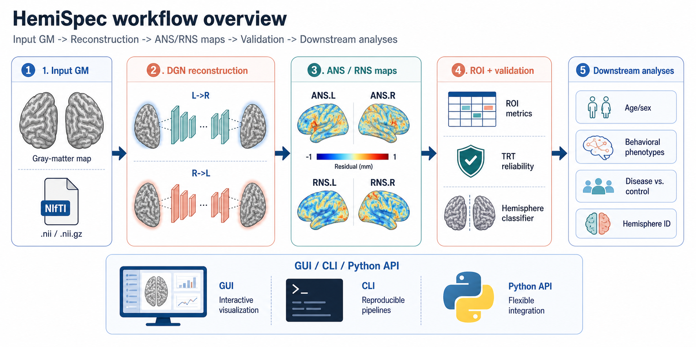

# HemiSpec

**HemiSpec** is a PyPI-first software and workflow toolkit for computing reconstruction-derived hemispheric specificity (ANS/RNS) from preprocessed gray-matter maps. The CLI and GUI are entry points installed into the same Python/PyTorch environment as the package and model cache.

  [Quick start](quickstart.md){ .md-button .md-button--primary }
  [Install from PyPI](installation.md){ .md-button }
  [Data and models](data-and-models.md){ .md-button }

## Workflow overview

<figure markdown="span">
  { width="100%" }
  <figcaption>Input GM maps → cross-hemispheric DGN reconstruction → ANS/RNS specificity maps → ROI summaries and validation → downstream analyses (age/sex effects, hemisphere classification, behavioral phenotypes, disease vs. control).</figcaption>
</figure>

## Choose your path

-   **Run HemiSpec**

    ---

    Create a PyPI-managed Python/PyTorch environment, then run the synthetic quickstart or launch the package-installed GUI.

    [Get started](installation.md)

-   **Understand ANS/RNS**

    ---

    Learn the reconstruction framework, metric definitions, and downstream task analysis.

    [Methods](methods/index.md)

-   **Model and data assets**

    ---

    DGN checkpoints, hemisphere-classifier bundles, and data policy.

    [Data and models](data-and-models.md)

-   **Developer docs**

    ---

    Architecture, API design, deployment, and roadmap.

    [Developer](developer/index.md)

## Citation

HemiSpec builds on the ANS/RNS framework from Wang et al. 2024 (*Patterns*).
See [Citation](citation.md) for the full reference.

HemiSpec v0.1.0 is a public beta; PyPI is the recommended install path, while GitHub Releases archive fallback artifacts. Source: [github.com/mqqq333/HemiSpec](https://github.com/mqqq333/HemiSpec).

---

  Made with <a href="https://squidfunk.github.io/mkdocs-material/" target="_blank" rel="noopener">Material for MkDocs</a>.

