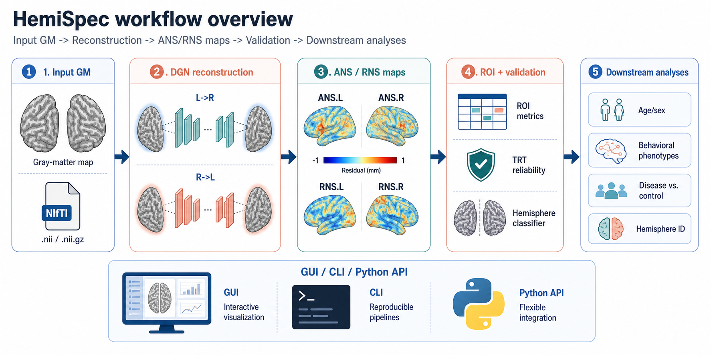

# HemiSpec

**HemiSpec** is a research-software toolkit for converting preprocessed gray-matter maps into bilateral reconstruction-derived hemispheric measures: **ANS** (absolute neuroanatomical specificity) and **RNS** (relative neuroanatomical specialization).

!!! important "Input boundary"
    HemiSpec does **not** accept raw T1-weighted MRI directly as DGN input. First convert each T1 image into an MNI152 1.5 mm masked gray-matter map (`*_GM_masked.nii.gz`) using the documented FSL preprocessing workflow.

  [Input and preprocessing](input-preprocessing.md){ .md-button .md-button--primary }
  [Quick start](quickstart.md){ .md-button }
  [Install from PyPI](installation.md){ .md-button }

## End-to-end workflow

<figure markdown="span">
  { width="100%" }
  <figcaption>T1-weighted MRI → FSL gray-matter preprocessing → MNI152 1.5 mm GM input → bilateral DGN reconstruction → ANS/RNS maps → optional ROI summaries and validation → downstream analyses.</figcaption>
</figure>

| Stage | Input | Main operation | Output |
| --- | --- | --- | --- |
| Preprocessing | T1-weighted NIfTI | FSL brain extraction, tissue segmentation, affine MNI registration, GM threshold/mask | `*_GM_masked.nii.gz` |
| Reconstruction | Preprocessed GM map | Left-to-right and right-to-left DGN inference | Reconstructed target hemispheres |
| Metric computation | Actual and reconstructed GM | ANS/RNS residual metrics | `ANS.L`, `ANS.R`, `RNS.L`, `RNS.R` maps |
| Optional summaries | Voxel maps + compatible atlas | ROI aggregation | Long and wide ROI tables |
| Optional validation | Maps/ROI features | Hemisphere classification and/or TRT analysis | Validation tables and plots |

## What belongs to the original method, and what HemiSpec adds

The cross-hemispheric DGN framework and ANS/RNS definitions originate from **Wang et al. (2024)**. HemiSpec packages that method into an installable API/CLI/GUI workflow, model-asset discovery, bilateral map export, ROI summaries, validation utilities, documentation, and release tooling.

- Original method and metrics: cite Wang et al. (2024).
- HemiSpec software or downstream studies: cite the relevant public software/manuscript record when available.

See [Citation](citation.md) for the complete reference and citation boundaries.

## Choose your path

-   **Prepare real MRI input**

    ---

    Start from T1-weighted NIfTI, run the packaged FSL script, and verify the DGN input grid and quality-control checks.

    [Input and preprocessing](input-preprocessing.md)

-   **Run HemiSpec**

    ---

    Install the PyPI package, inspect model readiness, and run the GUI or bilateral CLI workflow.

    [Quick start](quickstart.md)

-   **Understand the method**

    ---

    Review the reconstruction framework, original ANS/RNS definitions, and HemiSpec implementation details.

    [Methods](methods/index.md)

-   **Models and atlas assets**

    ---

    Learn how DGN checkpoints, classifier bundles, and optional ROI atlases are located and distributed.

    [Data and models](data-and-models.md)

## Current software scope

HemiSpec v0.1.0 is a public beta. PyPI is the primary install path. The GUI and CLI generate voxel-wise ANS/RNS maps; ROI tables, hemisphere-classifier validation, and TRT validation are currently optional downstream steps.

---

  Source: <a href="https://github.com/mqqq333/HemiSpec" target="_blank" rel="noopener">github.com/mqqq333/HemiSpec</a>. Documentation built with <a href="https://squidfunk.github.io/mkdocs-material/" target="_blank" rel="noopener">Material for MkDocs</a>.

