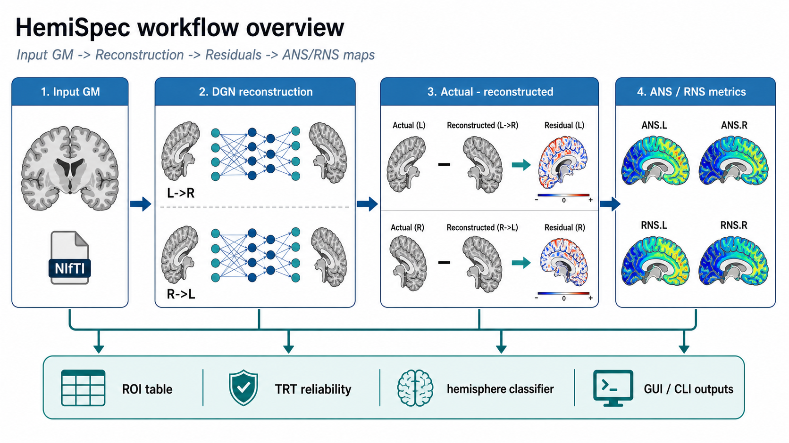

# HemiSpec

**HemiSpec** 是一个用于从预处理灰质图计算重建衍生的半球特异性（ANS/RNS）的软件与工作流工具包。

  [快速开始](quickstart.md){ .md-button .md-button--primary }
  [下载发布版](https://github.com/mqqq333/HemiSpec/releases/tag/v0.1.0){ .md-button }
  [数据与模型](data-and-models.md){ .md-button }

## 工作流概览

<figure markdown="span">
  { width="100%" }
  <figcaption>输入 GM 图 → 跨半球 DGN 重建 → ANS/RNS 特异性图 → ROI 汇总与验证。</figcaption>
</figure>

## 选择你的路径

-   **运行 HemiSpec**

    ---

    安装工具包，运行合成快速入门，或启动 GUI。

    [开始使用](installation.md)

-   **理解 ANS/RNS**

    ---

    学习重建框架、指标定义和利手性扩展。

    [方法](methods/index.md)

-   **模型与数据资产**

    ---

    DGN 检查点、半球分类器包和数据政策。

    [数据与模型](data-and-models.md)

-   **开发者文档**

    ---

    架构、API 设计、部署和路线图。

    [开发者](developer/index.md)

## 引用

HemiSpec 基于 Wang 等人 2024 年（*Patterns*）的 ANS/RNS 框架。
完整参考文献见 [引用](citation.md)。

HemiSpec v0.1.0 为公开测试版。源码：[github.com/mqqq333/HemiSpec](https://github.com/mqqq333/HemiSpec)。

---

  基于 <a href="https://squidfunk.github.io/mkdocs-material/" target="_blank" rel="noopener">Material for MkDocs</a> 构建。

