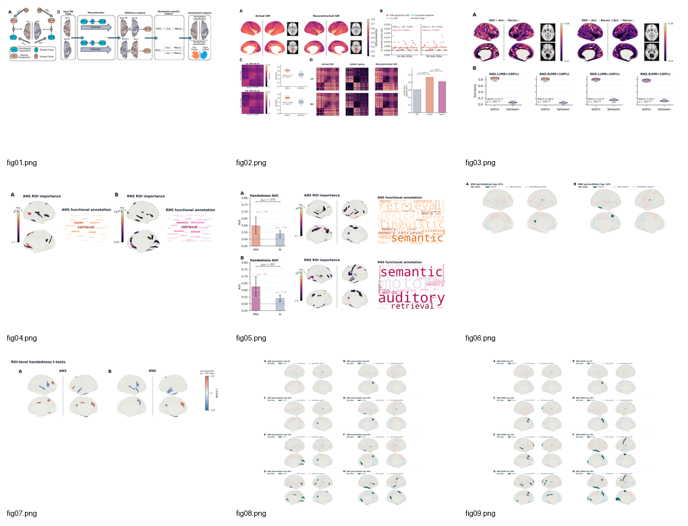
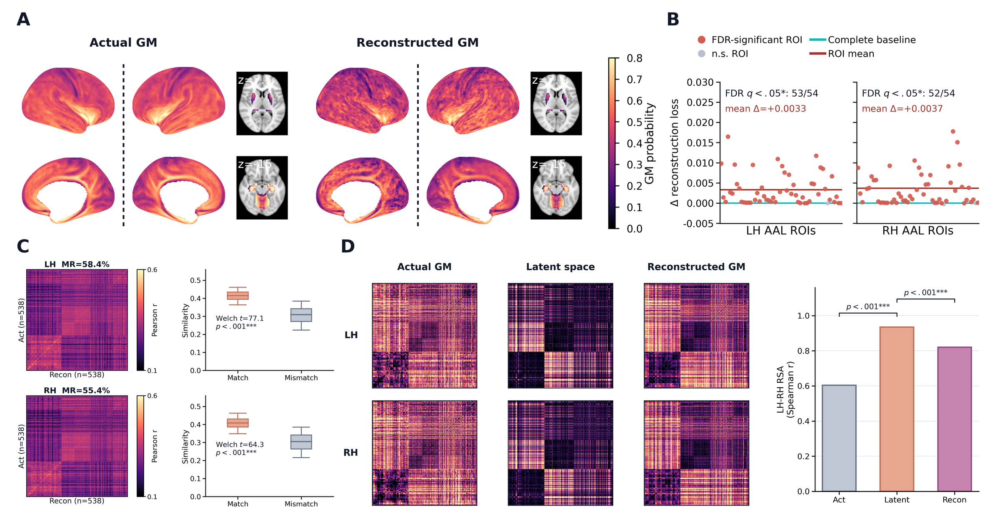
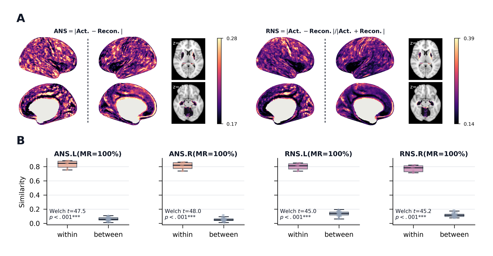
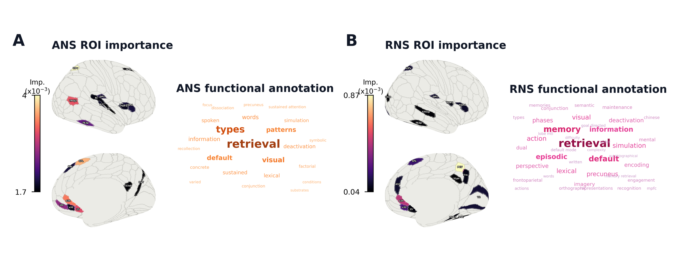
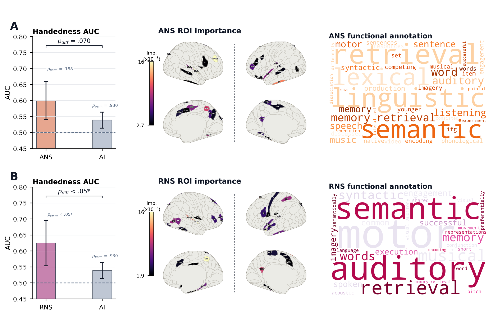
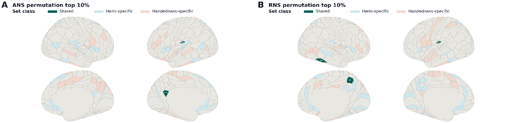
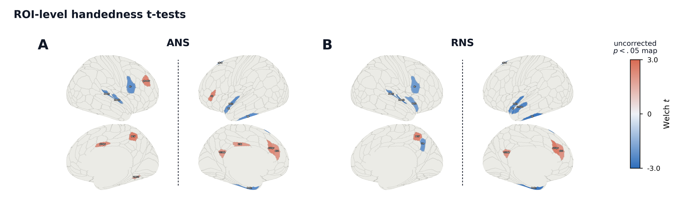
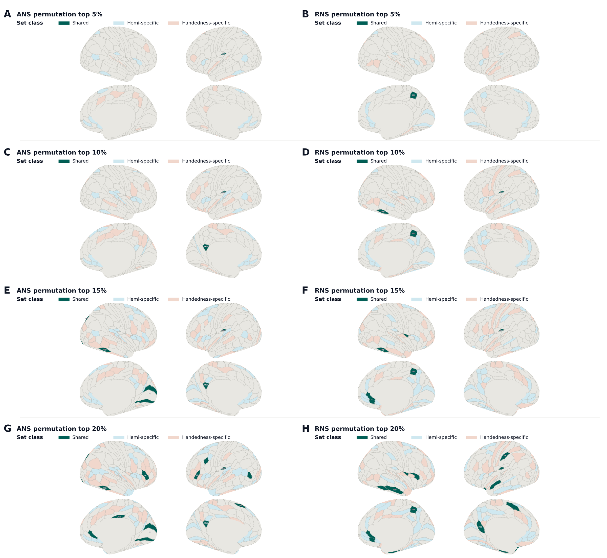
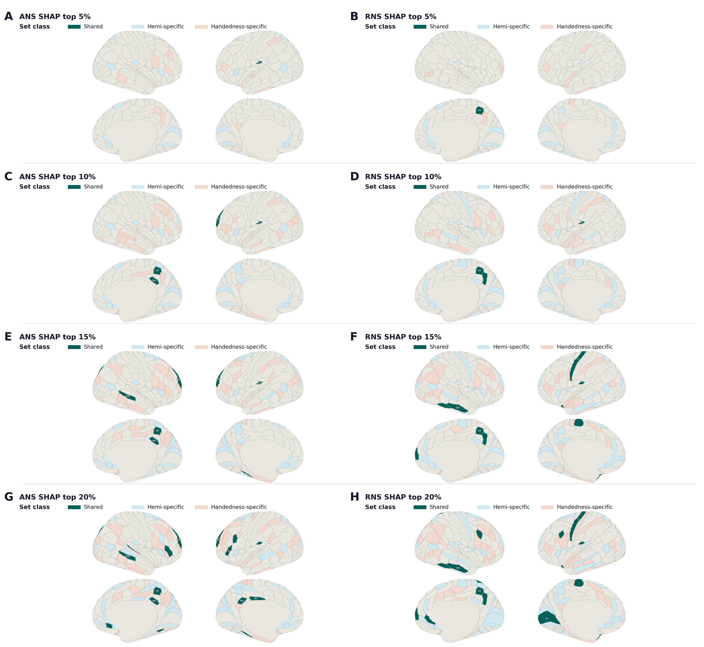

# 论文图表

项目负责人已批准在本 HemiSpec 主页展示当前稿件衍生图表。这些图片作为研究和软件工作流的视觉预览提供；最终图表编号、图注和引用文本应与公开稿件或预印本保持一致。

!!! note "图表出处"
    这些图表来自当前利手性/HemiSpec 稿件草稿材料。不应将其与私有受试者级数据或未发表的原始结果表混用。

## 联系单

<figure markdown="span">
  { width="100%" }
  <figcaption>当前稿件图表的概览联系单。</figcaption>
</figure>

## 图表画廊

### 图 1

<figure markdown="span">
  { width="100%" }
  <figcaption>研究设计概述；面板 1B 体现了网站工作流示意图的动机：输入 GM → 重建 → 差异分析 → 半球特异性指标。</figcaption>
</figure>

### 图 2

<figure markdown="span">
  { width="100%" }
  <figcaption>稿件衍生图预览；最终图注待与公开稿件同步。</figcaption>
</figure>

### 图 3

<figure markdown="span">
  { width="100%" }
  <figcaption>稿件衍生图预览；最终图注待与公开稿件同步。</figcaption>
</figure>

### 图 4

<figure markdown="span">
  { width="100%" }
  <figcaption>稿件衍生图预览；最终图注待与公开稿件同步。</figcaption>
</figure>

### 图 5

<figure markdown="span">
  { width="100%" }
  <figcaption>稿件衍生图预览；最终图注待与公开稿件同步。</figcaption>
</figure>

### 图 6

<figure markdown="span">
  { width="100%" }
  <figcaption>稿件衍生图预览；最终图注待与公开稿件同步。</figcaption>
</figure>

### 图 7

<figure markdown="span">
  { width="100%" }
  <figcaption>稿件衍生图预览；最终图注待与公开稿件同步。</figcaption>
</figure>

### 图 8

<figure markdown="span">
  { width="100%" }
  <figcaption>稿件衍生图预览；最终图注待与公开稿件同步。</figcaption>
</figure>

### 图 9

<figure markdown="span">
  { width="100%" }
  <figcaption>稿件衍生图预览；最终图注待与公开稿件同步。</figcaption>
</figure>
