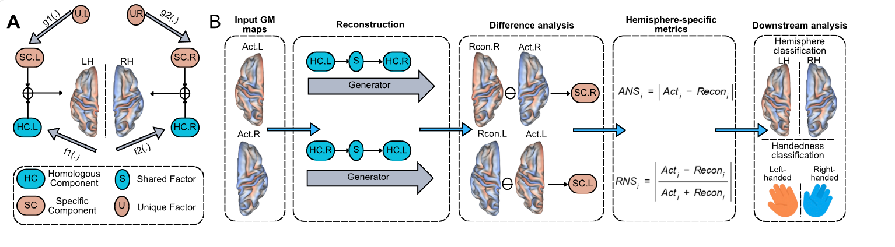

# Downstream task analysis

HemiSpec treats reconstruction-derived ANS/RNS maps as intermediate representations that can be used in downstream analyses of hemispheric structure and behavioral phenotypes. The method page is framed around this broader downstream-task layer rather than a single phenotype.

<figure markdown="span">
  { width="100%" }
  <figcaption>High-level HemiSpec workflow from reconstruction-derived hemispheric specificity maps to downstream task analyses. Result-specific figures and tables remain gated until manuscript release.</figcaption>
</figure>

## Downstream question

Can reconstruction-derived hemispheric specificity features capture structure-behavior information beyond conventional gray-matter-volume asymmetry indices or other direct left-right comparison baselines?

## Analyses in the current downstream scope

- Reconstruction plausibility of generated contralateral maps.
- Preservation of individual-specific information.
- Test-retest reliability of ANS/RNS maps.
- Hemisphere identity classification from ROI-level ANS/RNS features.
- Behavioral phenotype tasks, benchmarked against conventional GMV asymmetry-index or other direct left-right comparison baselines.
- Feature localization and overlap between hemisphere-identity and task-related profiles.

## Public result boundary

Until the manuscript or preprint is public, this page should frame downstream tasks as methodological test cases. Detailed result comparisons, model-performance claims, tables, and manuscript-specific figures should remain out of the public homepage. Detailed figures, exact tables, and manuscript-specific claims should be checked before public release if the relevant paper is not yet available as a preprint or publication.
