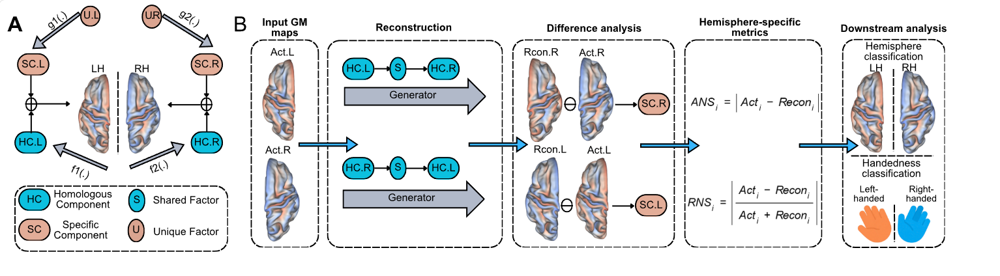

# 下游任务分析

HemiSpec 将重建衍生的 ANS/RNS 图作为中间表征，用于半球结构和行为表型相关的下游分析。本方法页以更宽泛的下游任务层为叙述对象，而不是只绑定到单一表型。

<figure markdown="span">
  { width="100%" }
  <figcaption>从重建衍生半球特异性图到下游任务分析的 HemiSpec 高层工作流。结果特定图表和表格在稿件发布前保持受控。</figcaption>
</figure>

## 下游问题

重建衍生的半球特异性特征，是否能在传统灰质体积不对称指数或其他直接左右比较基线之外，捕捉结构-行为相关信息？

## 下游分析范围

HemiSpec 已实现重建、ANS/RNS 图与 ROI 导出、半球分类和 TRT 验证。行为表型建模、基线比较以及任务相关特征定位需要用户提供分析代码，不属于内置工作流。以下列表描述的是更广泛的研究范围，并非已实现的命令列表。

- 生成对侧图的重建合理性。
- 个体特异信息的保留。
- ANS/RNS 图的测试-重测可靠性。
- 从 ROI 级 ANS/RNS 特征进行半球身份分类。
- 行为表型任务，并与传统 GMV 不对称指数或其他直接左右比较基线对比。
- 半球身份和任务相关特征分布的特征定位与重叠分析。

## 公开结果边界

在稿件或预印本公开之前，本页将下游任务定位为方法论测试案例。详细结果比较、模型性能声明、精确表格和稿件特定图表必须保留在公开文档之外，直到相关工作已有公开版本。
