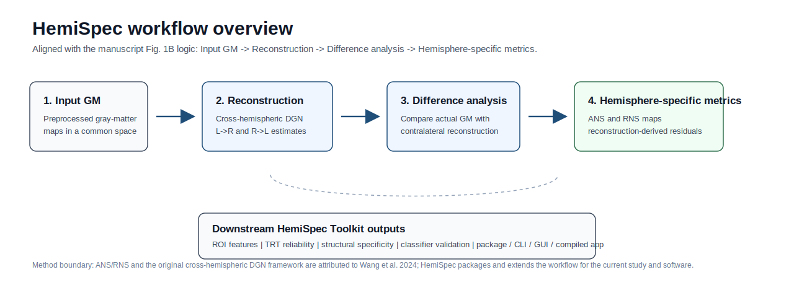
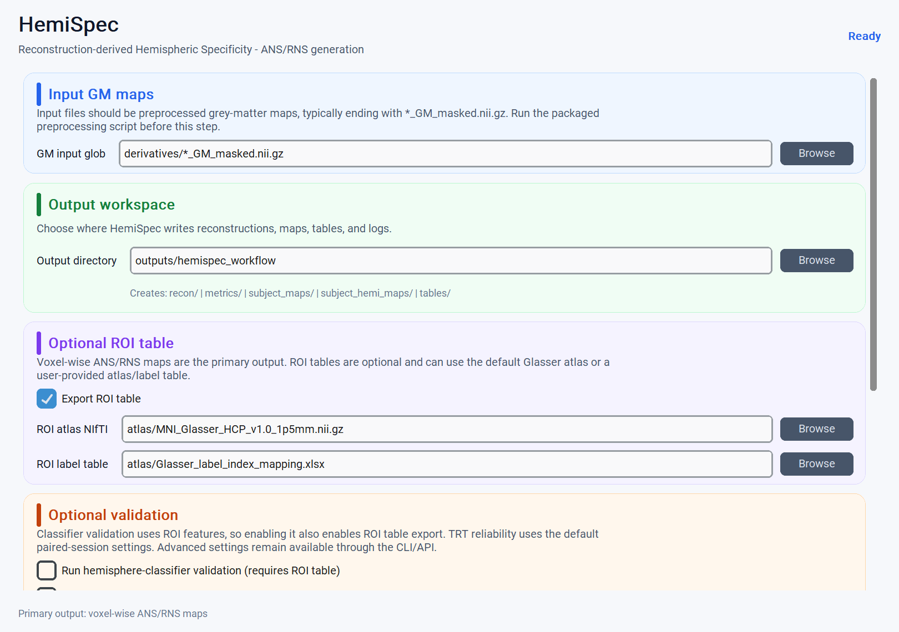

# Software overview

HemiSpec is organized as a small software ecosystem rather than a source-only repository: a Python package, a CLI, a GUI entry point, and compiled desktop folders built from the same public API.

<figure markdown="span">
  { width="100%" }
  <figcaption>HemiSpec follows the manuscript Fig. 1B sequence from Input GM to Reconstruction, Difference analysis, and Hemisphere-specific metrics, then extends those outputs into ROI tables, validation, and release artifacts.</figcaption>
</figure>

## User-facing layers

| Layer | Public name | Status | Purpose |
| --- | --- | --- | --- |
| Python package | `hemispec-toolkit` | In development / wheel builds locally | Installable API and command entry points. |
| CLI | `hemispec` | In development / local tests pass | Scriptable workflows for servers and clusters. |
| GUI | `hemispec-gui` | Compact standard-workflow GUI smoke-tested locally | Desktop launcher for ANS/RNS generation, optional ROI tables, and optional validation. |
| Compiled app | HemiSpec Desktop / HemiSpec Model App | Release target | Folder distributions for users who should not manage Python environments. |

<figure markdown="span">
  { width="100%" }
  <figcaption>Current compact GUI preview with public-safe placeholder paths. The GUI is a thin launcher over `hemispec workflow`.</figcaption>
</figure>

## Current GUI scope

The default GUI is intentionally narrow. It exposes the decisions normal users need to obtain ANS/RNS maps:

- preprocessed GM input glob,
- output workspace,
- optional ROI table export with atlas and label table paths,
- optional hemisphere-classifier validation,
- optional TRT reliability,
- run/open/copy-CLI/log controls.

It does not expose model checkpoints, device selection, thresholds, suffix rules, classifier bundle paths, or TRT regexes. Those advanced settings remain available through the CLI/API so that the GUI remains reproducible and easy to maintain.

## Current release split

- **Lightweight package/app:** CLI, compact GUI, compute, ROI export, validation, and inspection without bundling private model/data assets.
- **Model-enabled package/app:** end-to-end DGN inference plus ANS/RNS workflows using released DGN/classifier defaults from Git LFS, first-run cache download, or explicit offline assets; atlas files remain optional for ROI export.

The default public build should avoid silently bundling private `assets/`; model and atlas bundles should be explicit release artifacts with checksums, license notes, and compatibility metadata.
