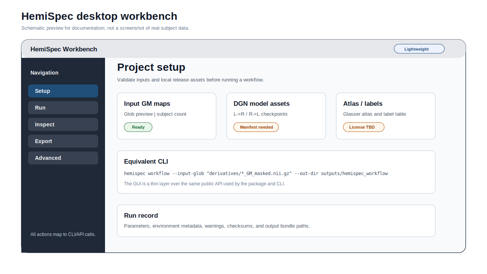

# Software overview

HemiSpec is being organized as a small software ecosystem rather than a source-only
repository: a Python package, a CLI, a GUI entry point, and compiled desktop
folders built from the same public API.

<figure markdown="span">
  { width="100%" }
  <figcaption>HemiSpec follows the manuscript Fig. 1B sequence from Input GM to Reconstruction, Difference analysis, and Hemisphere-specific metrics, then extends those outputs into ROI tables, validation, and release artifacts.</figcaption>
</figure>

## User-facing layers

| Layer | Public name | Status | Purpose |
| --- | --- | --- | --- |
| Python package | `hemispec-toolkit` | In development / wheel builds locally | Installable API and command entry points. |
| CLI | `hemispec` | In development / local smoke tests pass | Scriptable workflows for servers and clusters. |
| GUI | `hemispec-gui` | Source GUI and lightweight EXE smoke-tested locally | Desktop workbench for setup, run, inspect, and export. |
| Compiled app | HemiSpec Desktop / HemiSpec Model App | Release target | Folder distributions for users who should not manage Python environments. |

<figure markdown="span">
  { width="100%" }
  <figcaption>GUI design preview. This is a public-safe schematic, not a screenshot of real subject data.</figcaption>
</figure>

## Current release split

- **Lightweight package/app:** compute, ROI export, validation, and inspection
  without bundling private model/data assets.
- **Model-enabled package/app:** end-to-end DGN inference plus ANS/RNS workflows
  when approved DGN weights, atlas files, and model manifests are available.

The default public build should avoid silently bundling private `assets/`; model
and atlas bundles should be explicit release artifacts with checksums, license
notes, and compatibility metadata.
