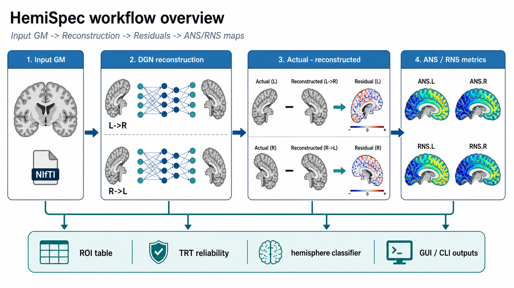
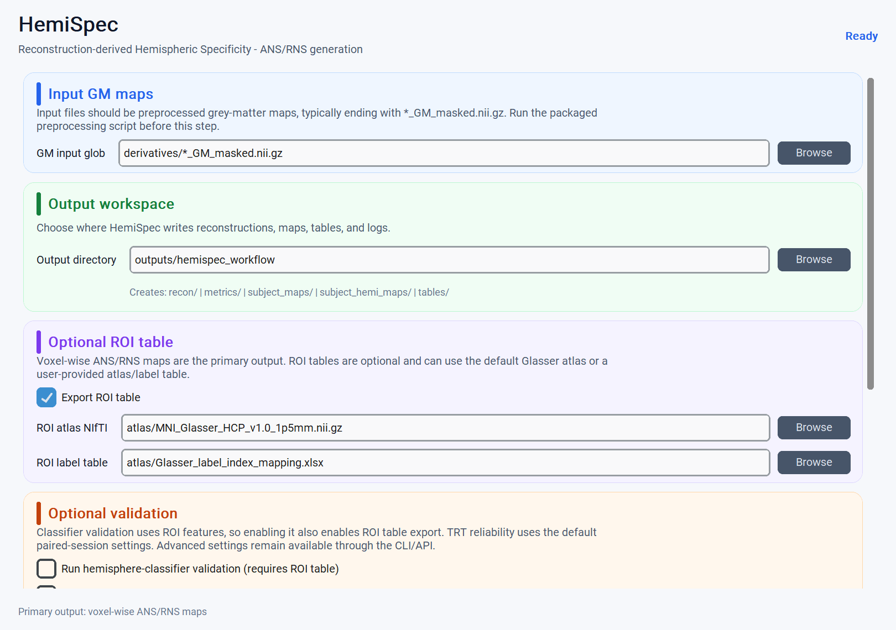

# Software overview

HemiSpec is organized as a package-first software ecosystem rather than a collection of standalone scripts. Current documentation targets a source installation from `main`; archived versions remain on the [GitHub Releases page](https://github.com/mqqq333/HemiSpec/releases), and the PyPI project is not public. The Python package is the primary artifact; the CLI and GUI entry points are built from the same public API.

<figure markdown="span">
  { width="100%" }
  <figcaption>HemiSpec follows the public workflow sequence from Input GM to Reconstruction, Difference analysis, and Hemisphere-specific metrics, then extends those outputs into ROI tables, validation, and release artifacts.</figcaption>
</figure>

## User-facing layers

| Layer | Public name | Status | Purpose |
| --- | --- | --- | --- |
| Python package | `hemispec-toolkit` | Primary public artifact | Installable API plus CLI/GUI entry points in the active Python/PyTorch environment. |
| CLI | `hemispec` | Package entry point | Scriptable workflows for servers and clusters. |
| GUI | `hemispec-gui` | Package entry point | Desktop launcher for ANS/RNS generation, optional ROI tables, and optional validation, run from the same environment as PyTorch. |
| Compiled app | HemiSpec Desktop / HemiSpec Model App | Build target | Optional folder distributions built from a source checkout. |

<figure markdown="span">
  { width="100%" }
  <figcaption>Current compact GUI preview with public-safe placeholder paths. The GUI is a thin launcher over `hemispec workflow`.</figcaption>
</figure>

## Current GUI scope

The default GUI is intentionally narrow. It exposes the decisions normal users need to obtain ANS/RNS maps:

- preprocessed GM input glob,
- output workspace,
- optional ROI table export with atlas and label table paths,
- optional hemisphere-classifier validation,
- optional TRT reliability,
- run/open/copy-CLI/log controls.

It does not expose model checkpoints, device selection, thresholds, suffix rules, classifier bundle paths, or TRT regexes. Those advanced settings remain available through the CLI/API so that the GUI remains reproducible and easy to maintain.

## Current release split

- **Current source package:** CLI, compact GUI launcher, compute, ROI export, validation, and inspection without bundling subject data or unapproved atlas assets.
- **Model-enabled environment:** end-to-end DGN inference plus ANS/RNS workflows using DGN and classifier assets from a Git LFS checkout or explicit approved local assets. Current `main` can cache-download DGN checkpoints from Git LFS media, but not the complete classifier bundle; see [Data and models](data-and-models.md#current-cache-download-boundary).

Atlas files remain optional for ROI export. The released classifier, however, requires its compatible Glasser 1.5 mm atlas and labels `1..180` left / `1001..1180` right; custom atlases are ROI-only. Public builds should not silently bundle private assets.

ANS/RNS and the cross-hemispheric DGN framework originate from Wang et al. (2024); see [Citation](citation.md).
